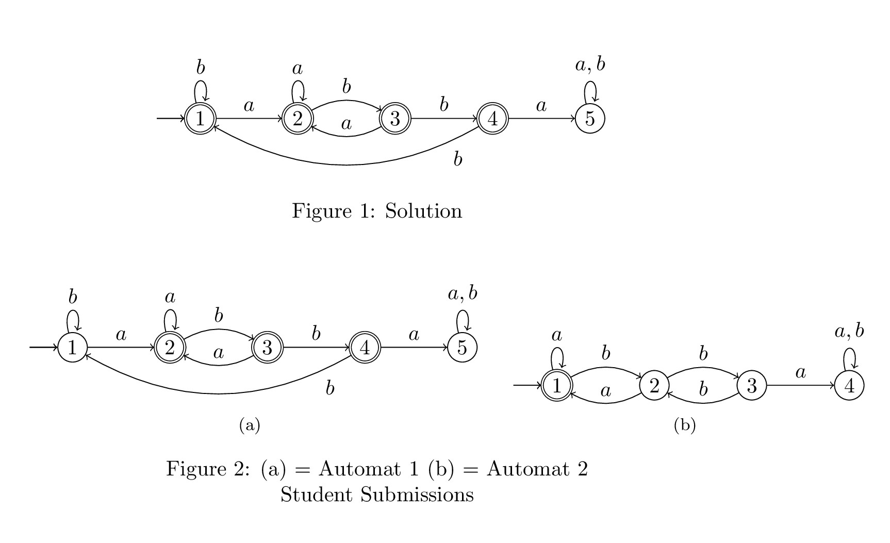

# Weight finite automata 

This is a project to determine the weight of a regular language represented by a finite automaton. Besides the weight of a language, a measure of how far 2 regular languages are from each other can be determined by determining the weight of the symetric difference. 

## Installation

TODO...

## Usage

TODO...

## Example
Here is an example of how the weighting of a language can be used for teaching. The task was to specify a finite automaton which describes the language of the words above the alphabet {a, b} which do not contain the subword "abba".A sample solution for this is given in the following graphic. In addition, two submissions of students are given. Here you can see that automata 1 A sample solution for this is given in the following graphic. In addition, two submissions of students are given. Here you can see that automat 1 is a better submission than the submission of automat 2, even if both submissions are not submissions that describe the required language. This is expressed by weighting the symmetric difference of the languages of these two automata to the sample solution by a metric value. Which significantly simplifies the evaluation of these deliveries. 



```python   
# Setting the alphabet.
FiniteAutomata.set_alphabet({'a', 'b'})

# Create a solution object.
sol = FiniteAutomata({0}, [(0, 'a', 2), (0, 'b', 0), (2, 'a', 2), (2, 'b', 3), (3, 'a', 2), (3, 'b', 1), (1, 'b', 0)], {0, 1, 2, 3})

# Determine the parameters. x is the proportion of the weight to be allocated to the constant part.
x = 0.5
eta = sol.get_length_longest_run() + 1
lam = (1-x)**(1/eta)

# Loading of different finite automata over the same alphabet.
a_1 = FiniteAutomata({0}, [(0, 'b', 0), (0, 'a', 3), (3, 'a', 3), (3, 'b', 2), (2, 'a', 3), (2, 'b', 1), (1, 'a', 4), (1, 'b', 1), (1, 'b', 3)], {1, 2, 3})
a_2 = FiniteAutomata({0}, [(0, 'a', 0), (0, 'b', 2), (2, 'a', 0), (2, 'b', 1), (1, 'b', 2), (1, 'a', 3)], {0, 1, 2})

# Determine the weight of the symmetrical difference and then print the result.
print(f'Weight diff. Automata 1 to Solution = {weight_diff(sol, a_1, eta, lam)[2]}')
print(f'Weight diff. Automata 2 to Solution = {weight_diff(sol, a_2, eta, lam)[2]}')

```

Console Output: 
```
Weight diff. Automata 1 to Solution = 0.05534231111710203
Weight diff. Automata 2 to Solution = 0.145111985762509
```

More examples can be found in the [Example.py](./Example.py) file.

## Project structure
- [Example.py](./Example.py)

  This file contains some examples of computations of the weights of regular languages represented by a finite automaton. Thus, the file should help to get an understanding of the application of weighting and to clarify the usage with some examples.  

- [FiniteAutomata.py](./FiniteAutomata.py)

  Finite automata can be used to create finite automata objects on which various operations such as minimization, determinization, complement formation, determination of the symmetric difference and many more can be performed. 

- [WeightFiniteAutomata.py](./WeightFiniteAutomata.py)

  This class can be used to calculate the weight of a FiniteAutomata object and the weight of the difference between two FiniteAutomata objects.

## Authors

Research group "[Theoretical Computer Science / Formal Methods](https://www.uni-kassel.de/eecs/fmv/ueber-uns)" of the University of Kassel.

- [Martin Lange](https://www.uni-kassel.de/eecs/fmv/team/detailansicht?tx_ukpersons_personfunctiondetail%5BpersonFunction%5D=105&cHash=d4aafd324e09a6f60e57566642936ee3)
- [Florian Bruse](https://www.uni-kassel.de/eecs/fmv/team/detailansicht?tx_ukpersons_personfunctiondetail%5BpersonFunction%5D=107&cHash=13125e24f465be73259db38fd7f9891e)
- [Maurice Herwig](https://www.uni-kassel.de/eecs/fmv/team/detailansicht?tx_ukpersons_personfunctiondetail%5BpersonFunction%5D=497&cHash=1c737081a13775b82036f707dc667f39)


## License
TODO...